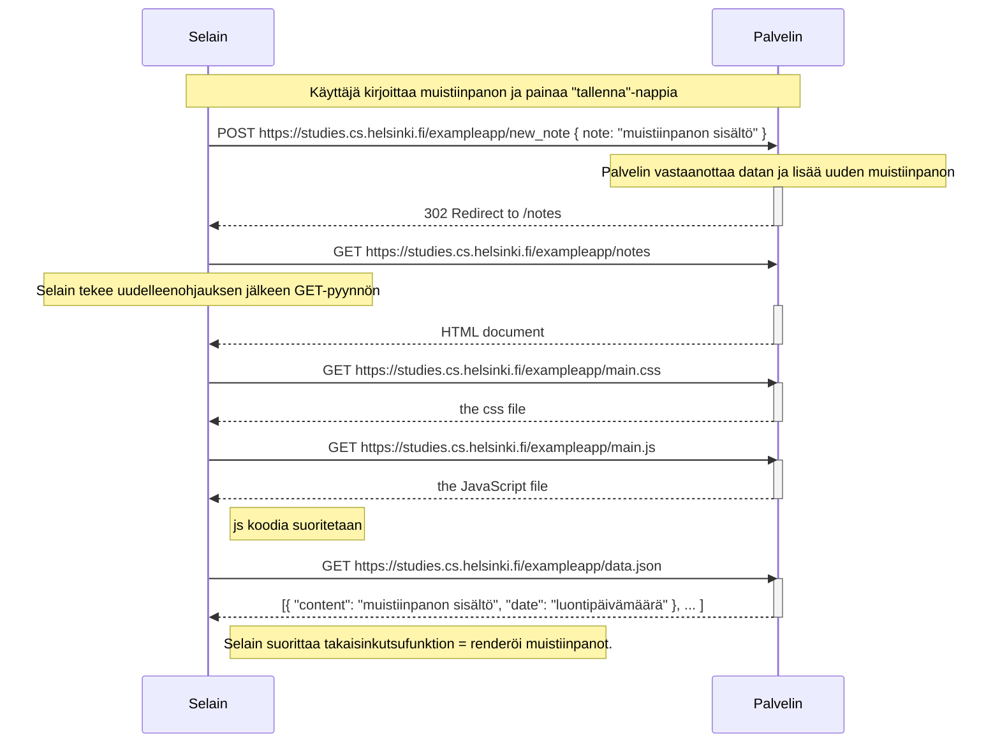

```mermaid
sequenceDiagram
    participant browser as Selain
    participant server as Palvelin
    
    Note over browser,server: Käyttäjä kirjoittaa muistiinpanon ja painaa "tallenna"-nappia
    
    browser->>server: POST https://studies.cs.helsinki.fi/exampleapp/new_note { note: "muistiinpanon sisältö" }
    Note over server: Palvelin vastaanottaa datan ja lisää uuden muistiinpanon
    activate server
    server-->>browser: 302 Redirect to /notes
    deactivate server
    
    browser->>server: GET https://studies.cs.helsinki.fi/exampleapp/notes
    Note over browser: Selain tekee uudelleenohjauksen jälkeen GET-pyynnön
    activate server
    server-->>browser: HTML document
    deactivate server
    
    browser->>server: GET https://studies.cs.helsinki.fi/exampleapp/main.css
    activate server
    server-->>browser: the css file
    deactivate server
    
    browser->>server: GET https://studies.cs.helsinki.fi/exampleapp/main.js
    activate server
    server-->>browser: the JavaScript file
    deactivate server
    
    Note right of browser: js koodia suoritetaan
    
    browser->>server: GET https://studies.cs.helsinki.fi/exampleapp/data.json
    activate server
    server-->>browser: [{ "content": "muistiinpanon sisältö", "date": "luontipäivämäärä" }, ... ]
    deactivate server    
    
    Note right of browser: Selain suorittaa takaisinkutsufunktion = renderöi muistiinpanot.
```