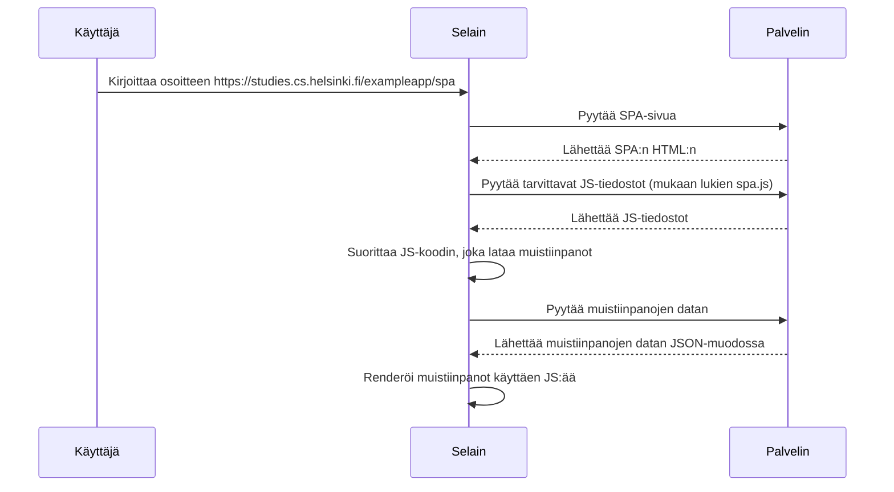

```mermaid
sequenceDiagram
    participant K as Käyttäjä
    participant S as Selain
    participant P as Palvelin

    K->>S: Kirjoittaa osoitteen https://studies.cs.helsinki.fi/exampleapp/spa
    S->>P: Pyytää SPA-sivua
    P-->>S: Lähettää SPA:n HTML:n
    S->>P: Pyytää tarvittavat JS-tiedostot (mukaan lukien spa.js)
    P-->>S: Lähettää JS-tiedostot
    S->>S: Suorittaa JS-koodin, joka lataa muistiinpanot
    S->>P: Pyytää muistiinpanojen datan
    P-->>S: Lähettää muistiinpanojen datan JSON-muodossa
    S->>S: Renderöi muistiinpanot käyttäen JS:ää
```
