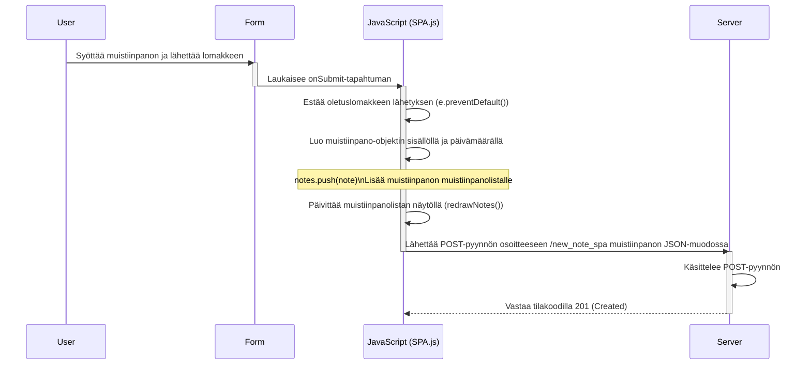

```mermaid
sequenceDiagram
    participant U as User
    participant F as Form
    participant JS as JavaScript (SPA.js)
    participant S as Server

    U->>F: Syöttää muistiinpanon ja lähettää lomakkeen
    activate F
    F->>JS: Laukaisee onSubmit-tapahtuman
    deactivate F
    activate JS
    JS->>JS: Estää oletuslomakkeen lähetyksen (e.preventDefault())
    JS->>JS: Luo muistiinpano-objektin sisällöllä ja päivämäärällä
    Note over JS: notes.push(note)\nLisää muistiinpanon muistiinpanolistalle
    JS->>JS: Päivittää muistiinpanolistan näytöllä (redrawNotes())
    JS->>S: Lähettää POST-pyynnön osoitteeseen /new_note_spa muistiinpanon JSON-muodossa
    deactivate JS
    activate S
    S->>S: Käsittelee POST-pyynnön
    S-->>JS: Vastaa tilakoodilla 201 (Created)
    deactivate S
```
