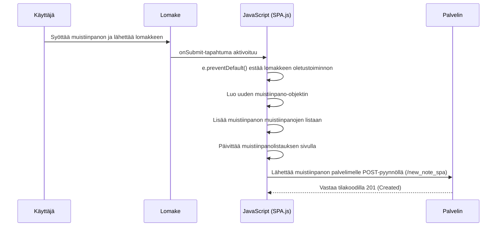

```mermaid
sequenceDiagram
    participant K as Käyttäjä
    participant L as Lomake
    participant JS as JavaScript (SPA.js)
    participant P as Palvelin

    K->>L: Syöttää muistiinpanon ja lähettää lomakkeen
    L->>JS: onSubmit-tapahtuma aktivoituu
    JS->>JS: e.preventDefault() estää lomakkeen oletustoiminnon
    JS->>JS: Luo uuden muistiinpano-objektin
    JS->>JS: Lisää muistiinpanon muistiinpanojen listaan
    JS->>JS: Päivittää muistiinpanolistauksen sivulla
    JS->>P: Lähettää muistiinpanon palvelimelle POST-pyynnöllä (/new_note_spa)
    P-->>JS: Vastaa tilakoodilla 201 (Created)
```